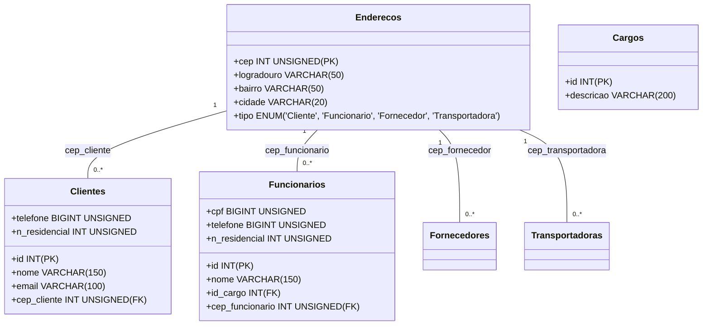

# Avanade Decola 2025 - Board de Tarefas API

## Principais Tecnologias
- Java 17: foi utilizada a versão 17 do Java, pois tem compatibilidade com o build do Maven;
- Spring Boot 3 (3.4.3): a versão mais recente LTS do Spring Boot;
- Spring Web
- Spring Data JPA: facilita a integração com bancos de dados SQL;
- Spring Security: para a autenticação e segurança da API;
- OpenAPI (Swagger): criação da documentação da API;
- MySQL

## Modelagem do Banco de Dados

O banco de dados possui as seguintes tabelas:

## Documentação da API (Deploy com Swagger)

...